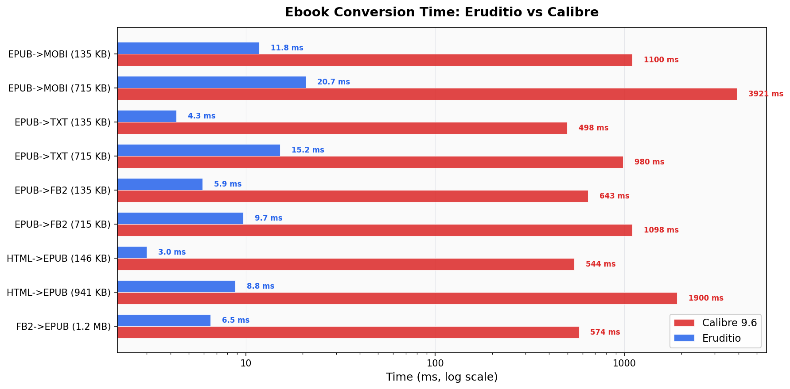
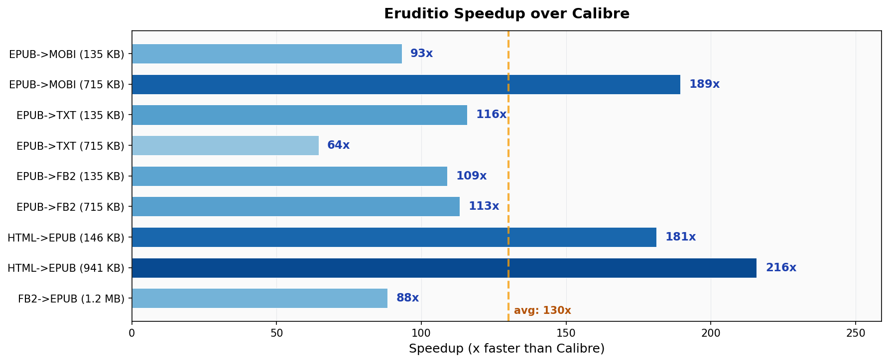

# Eruditio

A safe, fast, and production-ready Rust library for parsing and generating ebook files. Eruditio provides a unified API to read, transform, and write ebooks across 30+ formats — **64-216x faster** than Calibre on real-world conversions.

## Performance

Eruditio is written in pure Rust with zero-copy parsing, SIMD-accelerated text processing, and parallel compression. On typical ebook conversions it completes in single-digit milliseconds where Calibre takes seconds.

### Conversion Time (Eruditio vs Calibre 9.6)



### Speedup



| Conversion | Eruditio | Calibre 9.6 | Speedup |
|---|---:|---:|---:|
| EPUB -> MOBI (135 KB) | 11.8 ms | 1,100 ms | **93x** |
| EPUB -> MOBI (715 KB) | 20.7 ms | 3,921 ms | **189x** |
| EPUB -> TXT (135 KB) | 4.3 ms | 498 ms | **116x** |
| EPUB -> TXT (715 KB) | 15.2 ms | 980 ms | **64x** |
| EPUB -> FB2 (135 KB) | 5.9 ms | 643 ms | **109x** |
| EPUB -> FB2 (715 KB) | 9.7 ms | 1,098 ms | **113x** |
| HTML -> EPUB (146 KB) | 3.0 ms | 544 ms | **181x** |
| HTML -> EPUB (941 KB) | 8.8 ms | 1,900 ms | **216x** |
| FB2 -> EPUB (1.2 MB) | 6.5 ms | 574 ms | **88x** |

Measured on the same machine, median of 7 runs, using public domain Project Gutenberg ebooks. Calibre version 9.6.0.

## Supported Formats

### Reading (31 formats)

| Category | Formats | Notes |
|----------|---------|-------|
| **EPUB** | `.epub` | EPUB 2/3 with full metadata, spine, manifest, and TOC |
| **Kindle** | `.mobi`, `.azw`, `.azw3`, `.azw4`, `.prc` | MOBI/KF8 with EXTH metadata extraction; AZW4 extracts embedded PDF |
| **FictionBook** | `.fb2`, `.fbz` | XML-based FictionBook 2.0; FBZ is ZIP-compressed FB2 |
| **Comic Books** | `.cbz`, `.cb7`, `.cbr`, `.cbc` | ZIP, 7z, RAR archives; CBC supports multi-comic collections |
| **Plain Text** | `.txt`, `.txtz`, `.tcr` | Raw text, ZIP-compressed text, TCR-compressed text |
| **Rich Text** | `.rtf` | RTF with style preservation |
| **HTML** | `.html`, `.htm`, `.xhtml`, `.htmlz` | Single-file HTML; HTMLZ is ZIP-bundled HTML with resources |
| **Markdown** | `.md` | CommonMark via pulldown-cmark |
| **Open eBook** | `.oeb` | OPF-based Open eBook format (ZIP container) |
| **Kobo** | `.kepub`, `.kepub.epub` | Kobo-enhanced EPUB |
| **Palm** | `.pdb` | PalmDOC, zTXT, eReader, Plucker, and Haodoo subtypes |
| **eReader** | `.pml`, `.pmlz` | Palm Markup Language; PMLZ is ZIP-compressed PML |
| **Rocket eBook** | `.rb` | NuvoMedia Rocket eBook |
| **Sony BBeB** | `.lrf` | Sony Broadband eBook with LRF object stream parsing |
| **Shanda Bambook** | `.snb` | Shanda Bambook with SNBP container, zlib/bz2 decompression |
| **DjVu** | `.djvu`, `.djv` | Text layer extraction via IFF85 chunk parsing + BZZ decompression |
| **CHM** | `.chm` | Microsoft Compiled HTML Help via ITSS container + LZX decompression |
| **LIT** | `.lit` | Microsoft Reader with binary-to-HTML conversion; DRM level 1/3 decryption |

### Writing (25 formats)

| Category | Formats |
|----------|---------|
| **EPUB** | `.epub` |
| **Kindle** | `.mobi`, `.azw`, `.azw3`, `.prc` |
| **FictionBook** | `.fb2`, `.fbz` |
| **Comic Books** | `.cbz` |
| **Plain Text** | `.txt`, `.txtz`, `.tcr` |
| **Rich Text** | `.rtf` |
| **HTML** | `.html`, `.htmlz` |
| **Markdown** | `.md` |
| **Open eBook** | `.oeb` |
| **Kobo** | `.kepub` |
| **Palm** | `.pdb` (PalmDOC, zTXT, eReader) |
| **eReader** | `.pml`, `.pmlz` |
| **Rocket eBook** | `.rb` |
| **Sony BBeB** | `.lrf` |
| **Shanda Bambook** | `.snb` |
| **LIT** | `.lit` |
| **PDF** | `.pdf` (stub) |

### Planned

| Format | Status |
|--------|--------|
| PDF reading | Stub (returns unsupported error) |
| DOCX | Planned |
| ODT | Planned |

## CLI

Eruditio ships a CLI converter (`eruditio-convert`) with the same interface as Calibre's `ebook-convert`:

```bash
# Build
cargo +nightly build --release

# Convert
./target/release/eruditio-convert input.epub output.mobi

# With metadata overrides
./target/release/eruditio-convert book.html book.epub --title "My Book" --authors "Jane Doe"

# List all supported formats
./target/release/eruditio-convert --list-formats
```

## Library Usage

Add `eruditio` to your `Cargo.toml`:

```toml
[dependencies]
eruditio = "0.1.0"
```

### Basic Example

```rust
use eruditio::EruditioParser;

fn main() -> Result<(), eruditio::EruditioError> {
    // Parse an ebook file, automatically detecting format by extension
    let book = EruditioParser::parse_file("path/to/book.epub")?;

    // Access metadata
    println!("Title: {:?}", book.metadata.title);
    println!("Authors: {:?}", book.metadata.authors);

    // Iterate chapters
    for chapter in book.chapters() {
        println!("Chapter: {:?}", chapter.title);
    }

    Ok(())
}
```

### Format Conversion via Pipeline

```rust
use eruditio::{Pipeline, Format, ConversionOptions};
use std::io::Cursor;

let html = std::fs::read("book.html").unwrap();
let mut input = Cursor::new(&html);
let mut output = Vec::new();

let pipeline = Pipeline::new();
pipeline.convert(
    Format::Html,
    Format::Epub,
    &mut input,
    &mut output,
    &ConversionOptions::all(),
)?;

std::fs::write("book.epub", &output)?;
```

### Format Detection

```rust
use eruditio::Format;

// By extension
let fmt = Format::from_extension("djvu"); // Some(Format::Djvu)

// By magic bytes
let fmt = Format::from_magic_bytes(b"AT&TFORM..."); // Some(Format::Djvu)
let fmt = Format::from_magic_bytes(b"ITOLITLS..."); // Some(Format::Lit)
let fmt = Format::from_magic_bytes(b"ITSF...."); // Some(Format::Chm)
```

### Read from a Stream

```rust
use eruditio::EruditioParser;
use std::io::Cursor;

let data = std::fs::read("book.fb2").unwrap();
let mut cursor = Cursor::new(data);
let book = EruditioParser::parse(&mut cursor, Some("fb2"))?;
```

## Architecture

```
src/
├── domain/          Core models (Book, Chapter, Metadata, Resource, Format)
├── formats/         Format-specific readers and writers
│   ├── common/      Shared utilities (XML, HTML, ZIP, ITSS container, intrinsics)
│   ├── epub/        EPUB reader/writer
│   ├── mobi/        MOBI/KF8 reader/writer
│   ├── djvu/        DjVu reader (IFF85 parser + BZZ decompressor)
│   ├── chm/         CHM reader (ITSS + LZX decompression)
│   ├── lit/         LIT reader/writer (ITSS + unbinary + MS DES/SHA1 for DRM)
│   ├── lrf/         Sony LRF reader/writer
│   ├── html/        HTML reader/writer
│   ├── rtf/         RTF reader/writer
│   ├── pml/         PML reader/writer
│   └── ...          Other format modules (FB2, CBZ, SNB, OEB, MD, PDB, etc.)
├── transforms/      Book-to-Book transformation pipeline
├── pipeline/        Format registry and conversion orchestration
├── parser.rs        EruditioParser — unified entry point
├── error.rs         Error types (EruditioError)
└── lib.rs           Public API re-exports
```

~50,000 lines of Rust across the library, tests, and benchmarks.

Key design principles:

- **Pure Rust**: No C/C++ dependencies for format parsing. BZZ, LZX, MS DES, MS SHA-1, PalmDOC LZ77, and Huffman/CDIC decoders are all implemented in Rust.
- **SIMD-accelerated**: Hot paths use `memchr` and hand-tuned byte scanning for whitespace skipping, pattern matching, and HTML entity decoding.
- **Stream-oriented**: All readers accept `&mut dyn Read`, enabling parsing from files, network streams, or in-memory buffers.
- **Trait-based**: `FormatReader` and `FormatWriter` traits allow uniform handling across all formats.
- **Immutability**: `Book` and all domain types are treated as immutable values. Transforms produce new `Book` instances.
- **Parallel compression**: EPUB writing uses Rayon for parallel deflate across entries.

## Testing

```bash
# Run all tests (requires nightly for edition 2024)
cargo +nightly test

# Run tests for a specific format
cargo +nightly test djvu
cargo +nightly test lit
cargo +nightly test chm
```

The test suite includes 1000+ tests covering unit tests within each format module and integration tests in `tests/`.

### Running Benchmarks

```bash
# Criterion micro-benchmarks
cargo +nightly bench --bench conversion

# Full comparison against Calibre (requires ebook-convert)
python3 bench_compare.py
```

## Test Data Management

Curated test data lives in `test-data/` (committed to git):

```
test-data/
├── compliance/           # Official specification test suites
│   ├── w3c-epub33/      # W3C EPUB 3.3 Reading System Tests (178 EPUBs)
│   └── idpf-epub30/     # IDPF EPUB 3.0 Conformance Tests (21 EPUBs)
├── real-world/           # Public domain ebooks (Project Gutenberg)
│   ├── small/           # <1MB — 52 files (EPUBs + HTML)
│   ├── medium/          # 1-10MB — 10 files (MOBI, CBZ, CBR, CB7, CBC, EPUB)
│   └── large/           # >10MB — gitignored, download on demand
├── adversarial/          # Security/DoS test cases (handcrafted)
└── generated/            # Ephemeral golden files (gitignored)
```

Large test assets (`assets/`) and third-party reference code (`3rdparty/`) are gitignored. These are used for local development only and are not required for the standard test suite.

### Contributing Test Data

- All committed test files must have a clear license (public domain or permissive).
- Binary test files must be listed in `test-data/real-world/MANIFEST.md` with SHA256 checksums.
- Files >10MB should not be committed directly — add them to `test-data/real-world/large/` (gitignored).

## License

This project is licensed under the [Apache License 2.0](LICENSE).
